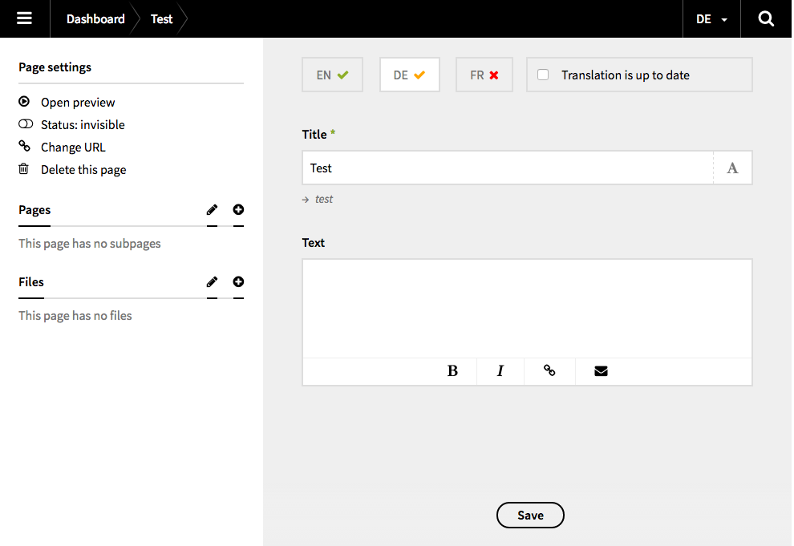

# Kirby Translations

With this field plugin for [Kirby 2](http://getkirby.com) you can display the translation status for pages in the panel. 

## Please notice

This is just the first version and a rather basic implementation. There's a lot of new stuff going on at the [develop](https://github.com/flokosiol/kirby-translations/tree/develop) branch. So please stay tuned to get the latest news :)

## Preview




## Installation

### Copy & Paste

Add (if necessary) a new `fields` folder to your `site` directory. Then copy the whole content of this repository in a new folder called `translations`. Your directory structure should now look like this:

```
site/
  fields/
    transaltions/
      ...
```

### Git Submodule

It is possible to add this plugin as a Git submodule.

```bash
$ cd your/project/root  
$ git submodule add https://github.com/flokosiol/kirby-translations.git site/fields/translations
```

For more information, have a look at [Working with Git](http://getkirby.com/blog/working-with-git) in the Kirby blog.


## Usage

Now you are ready to use the new field `translations` in your blueprints. 

```
...
fields:
  mytranslations:
    type: translations
...
```